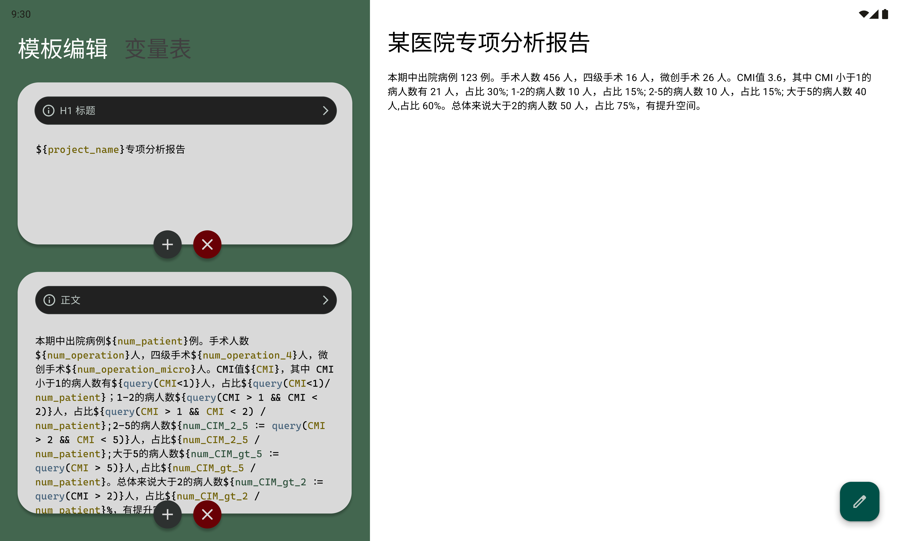

# `template-cl`

A example clojure backend to
act as a template management server.

Check the UI design in [Figma](https://www.figma.com/file/X7U1e8WymPTkrIzhlJDEY7/Hostpital?type=design&node-id=402%3A2812&mode=design&t=n3IXkTt4wO3N2EFz-1).

